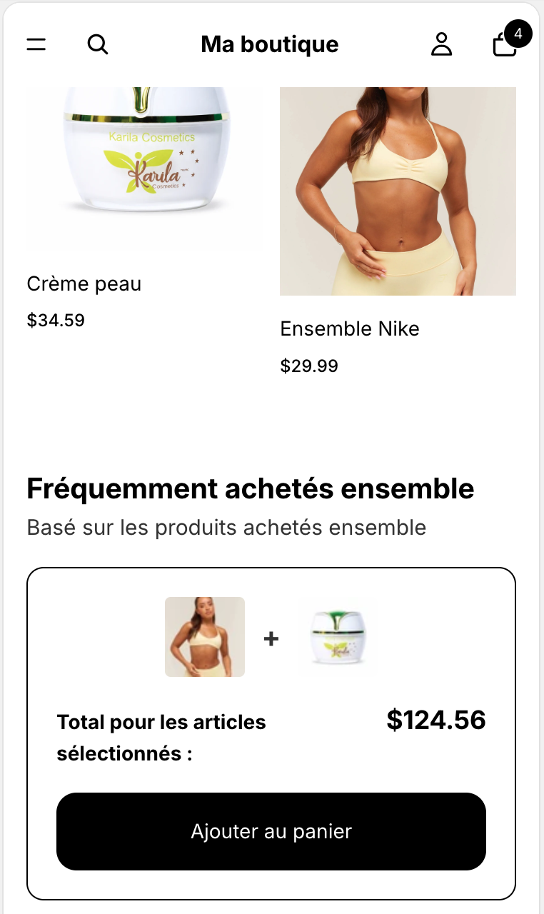

<a href="README.fr.md">Lire en français</a>

# Shopify Frequently Bought Together — Amazon-style cross-sell widget

A theme-native "Frequently bought together" section for Shopify product
pages: the main product plus up to 3 complementary products, shown as
thumbnails connected by "+" signs, with a live total and a single button
that adds everything to the cart in one click — the same pattern Amazon made
famous.

Built for the **Shopify Horizon** theme. No third-party app, no monthly fee.

## Features

- **Sourced automatically or manually.** By default, complementary products
  come from Shopify's own "complementary" product recommendations engine —
  zero merchant setup. A merchant can override this per instance by picking
  up to 3 products by hand instead.
- **A section, not a block — addable on any page.** Unlike a block that's
  locked into wherever it's nested, this is a standalone section: add it to
  a product page (it defaults to the current product) or to any other page
  with an explicit product picker.
- **One click adds everything.** The main product (at its currently
  selected variant) plus every complementary product shown, as a single
  multi-item cart request — no per-item checkboxes to manage.
- **Live total.** Recalculates from the main product's resolved price ×
  quantity plus every complementary product's price.
- **Syncs with a "buy more, save more" tier picker**, if the theme has one
  (see [shopify-bundle-selector](https://github.com/pteyo032/shopify-bundle-selector))
  — both the price and quantity added follow whichever tier is selected.
- **Configurable border, title, subtitle and button text** — no code
  changes needed to match a design reference.

## Repository contents

This repo contains **only the custom code for this feature** — not the full
Horizon theme, which belongs to Shopify. You drop these files into an
existing Horizon (or Horizon-based) theme.

| Path | What it is |
|---|---|
| `sections/frequently-bought-together.liquid` | The section: markup, styles, schema |
| `assets/frequently-bought-together.js` | The `<frequently-bought-together-component>` web component — variant/tier sync, live total, cart submission |
| `locales/*.json`, `locales/*.schema.json` | English + French translations (storefront text and editor labels) |
| `docs/integration-guide.md` | How to install it, source products automatically vs. manually, and make it appear on every product page automatically |
| `docs/product-json-snippet.json` | A ready-to-adapt template JSON entry for the "appears everywhere automatically" setup |
| `docs/gotchas.md` | Technical pitfalls discovered while building this, so you don't re-hit them |

## Quick start

1. Copy `sections/`, `assets/` and the locale keys from `locales/` into your
   theme.
2. In the theme editor, add the **Frequently bought together** section to a
   product page (or any page, with a product picked manually).
3. Leave "Complementary products" empty for automatic recommendations, or
   pick up to 3 products manually.

For making it appear on every product page without adding it by hand each
time, see `docs/integration-guide.md`.

## Known limitation

Shopify's automatic complementary-product recommendations depend on order
history. A new store, or a product with few past orders, may show nothing
in automatic mode for a while — this is expected Shopify behavior, not a
bug in this code. Use the manual override for predictable results on a new
store.

## License

MIT — see `LICENSE`.
